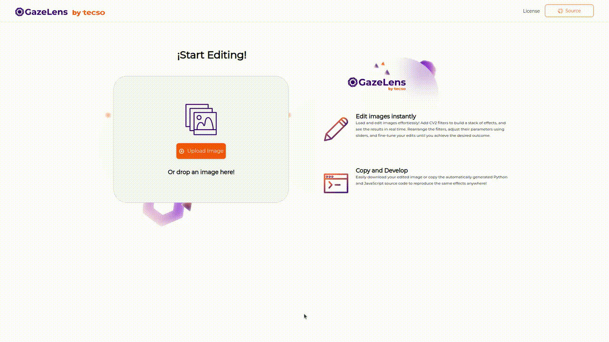

## Description

This project aims to develop a web application that allows applying filters to images using [OpenCV js](https://docs.opencv.org/4.x/d5/d10/tutorial_js_root.html).

The main motivation that led us to develop it was the need to be able to apply filters in a simple and practical way, to view the visual changes without the need to write code or run scripts. We also thought about making it open source so that everyone can use it on their own computers.

Once we have achieved the desired objectives by applying the filters, we will be able to access the source code for the [Python](https://www.python.org/) and Javascript programming languages ​​so that we can use it in our projects.

## How to install or run

To run it you just need to clone the repository or download it and then run or open the `index.html` file in your browser. Or you can try it [here](https://tecsocoop.github.io/gazelens/)

It is also possible to run it on your server but we are not going to go into detail on how to do this because it is a standard web application and does not require extensive configuration.

## How to use it!

The way to use it is simple, we just have to upload the image we want to modify and start applying the different filters. 

## Projects

### External dependencies

### [HTML](https://html.spec.whatwg.org/) & [CSS](https://www.w3.org/Style/CSS/specs.en.html)

HTML and CSS are the foundation technologies for web development.

We have selected HTML and CSS for the following reasons:

- Standard: HTML and CSS are standards of the web world, which means that our application will be compatible with most browsers and devices.
- Flexibility: HTML and CSS allow us to create web applications that fit different styles and needs.
- Extensive documentation and community: HTML and CSS have extensive documentation and an active community, which means that there are many resources available to help us solve problems and improve our application.

### [JavaScript](https://ecma-international.org/technical-committees/tc39/)

JavaScript is a fundamental technology for dynamic web development.

We have chosen JavaScript for the following reasons:

- Interactivity: JavaScript allows us to create interactive and dynamic web applications that adapt to the needs of our users.
- Access to the power of OpenCV.js: JavaScript allows us to access the power of OpenCV.js and use its functionalities to process images and apply filters.
- Flexibility and scalability: JavaScript is compatible with a wide variety of browsers and devices, allowing us to create applications that adapt to different environments and devices.

### [Bulma CSS](https://bulma.io/)

Bulma CSS is an open source CSS framework that allows us to create web applications with an attractive and easy-to-use design. We have selected BulmaCSS for the following reasons:

- Attractive and easy-to-use design: BulmaCSS offers an attractive and easy-to-use design that allows us to create web applications that fit different styles and needs.
- Flexibility and customization: BulmaCSS is very flexible and can be customized to fit the specific needs of our project.
- Active community: BulmaCSS has an active and growing community, which means that there are many developers and experts who can help us solve problems and improve the framework.

### [OpenCV js](https://docs.opencv.org/4.x/d5/d10/tutorial_js_root.html)

OpenCV.js is an open source library that allows access to OpenCV's image processing functionalities from the client side.

We have selected OpenCV.js for the following reasons:

- Access to the power of OpenCV: OpenCV is one of the most popular and powerful image processing libraries. With OpenCV.js, we can access these functionalities from the client side, allowing us to create more interactive and customized applications.
- Flexibility and scalability: OpenCV.js is compatible with a wide variety of browsers and devices, allowing us to create applications that fit different environments and devices.
- Active community: OpenCV.js has an active and growing community, which means that there are many developers and experts who can help us solve problems and improve the library.

### Integration of external dependencies

To create our application, we have integrated OpenCV.js and BulmaCSS in the following way:

- OpenCV.js: We have used OpenCV.js to create the image processing algorithms that are responsible for applying the filters to the images.
- BulmaCSS: We have used BulmaCSS to create the layout and user interface of our application. BulmaCSS has allowed us to create an attractive and easy-to-use user interface that fits the needs of our application.

## Contributing 

There are many ways in which you can participate in this project, for example:

- Submit bugs and feature requests, and help us verify as they are checked in
- Review source code changes
- Review the documentation and make pull requests for anything from typos to additional and new content

If you are interested in fixing issues and contributing directly to the code base, please see the document [How to Contribute](https://github.com/tecsocoop/gazelens/blob/main/CONTRIBUTING.md), which covers the following:

- Fork this repository
- Clone your forked repository
- Add your scripts
- Commit and push
- Create a pull request
- Star this repository
- Wait for pull request to merge
- Celebrate your first step into the open source world and contribute more

## Disclaimer

Applying filters to images in JavaScript can produce different results compared to applying filters in Python. This is due to the interpretation of numeric data types in each programming language, which can affect the accuracy and consistency of the results.

Although the difference in applying a single filter may be imperceptible, error propagation when applying multiple filters can result in final results that differ significantly between JavaScript and Python.

It is important to be aware of these differences when using filtering in JavaScript, and consider the potential implications on the accuracy and quality of the results.

## Credits

Developed by tecso work cooperative - Technology - Artificial Intelligence.

Know about us in [tecso.coop](https://tecso.coop/)

 

## License

Licensed under the MIT license.
